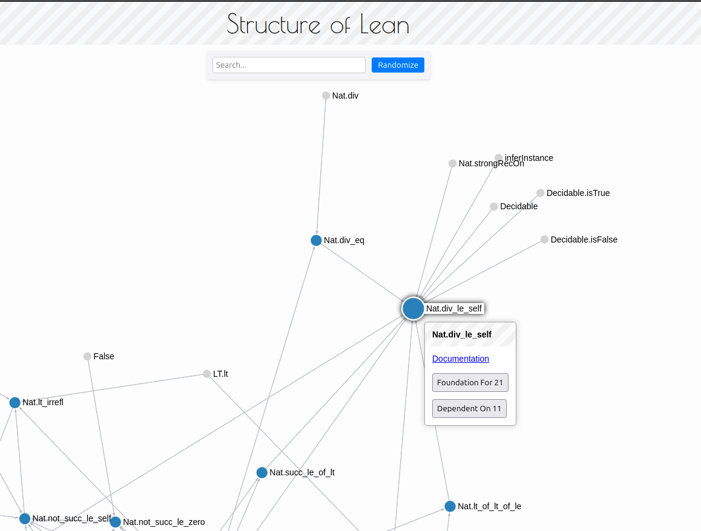

# LeanStructure

This application visualizes the dependencies of lean4 and mathlib4 proofs on a theorem level.

Check out the demo here: [https://oli.show/leanstructure](https://oli.show/leanstructure)

## Interaction

- Hovering over a node highlights all edges.
- Click a node to open a tooltip with more information.
- Links to documentation use [loogle.lean-lang.org](https://loogle.lean-lang.org).
- Search for nodes by name.
- Node colors indicate node status.
- Double-clicking a node will simplify its children.

## Technical

- Based on Lean4 v4.15.0-rc1: 172104 nodes and 787646 edges
- Data processing was done in Python using the tracing functionality of [LeanDojo](https://github.com/lean-dojo/LeanDojo).
- Frontend uses TypeScript, Svelte, and Sigma.js.
- CD using GitHub Actions.

## Similar Projects

Check out these other projects that visualize Lean dependencies:

- [lean-graph](https://github.com/patrik-cihal/lean-graph)
- [leanblueprint](https://github.com/PatrickMassot/leanblueprint)
- [mathlib-import-graph](https://github.com/eric-wieser/mathlib-import-graph)
- [Live version of mathlib-import-graph](https://leanprover-community.github.io//mathlib4_docs/mathlib.html)

## License

MIT